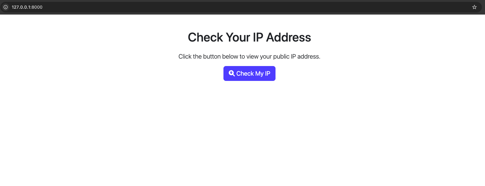
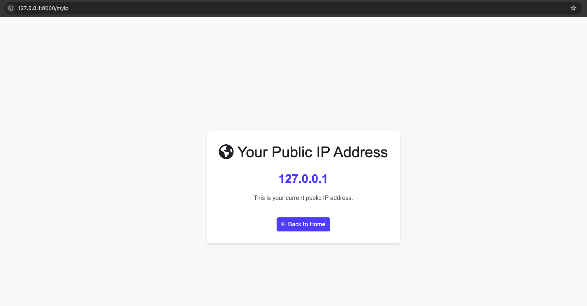

# MyIP - Django-based Public IP Checker

MyIP is a simple Django-based web application that allows users to check their public IP address. It includes a home page with a button to view the user's IP address and a dedicated page to display it in a clean, user-friendly design. The application uses Bootstrap 5 and FontAwesome for styling.

## Follow for awesome stuff:
- **👉 Checkout some more awesome tools at [GetCyber](https://getcyber.me/tools)**
- **👉 Subscribe to my YouTube Channel [GetCyber - YouTube](https://youtube.com/getCyber)**
- **👉 Discord Server [GetCyber - Discord](https://discord.gg/YUf3VpDeNH)**

---

## Features

- **Home Page**: A user-friendly landing page with a button to check the IP address.
- **Public IP Display**: A dedicated page that displays the user's public IP address.
- **Responsive Design**: Built using Bootstrap 5 for modern and responsive UI.
- **FontAwesome Icons**: Integrated with FontAwesome for enhanced visual appeal.

---

## Demo

### Home Page (`/`)
The home page features:
- A welcome message.
- A button to redirect users to the `/myip` page.



### Public IP Page (`/myip`)
The `/myip` page displays:
- The user's public IP address prominently.
- A "Back to Home" button for easy navigation.



---

## Prerequisites

Before running the application, ensure you have the following installed:

- Python 3.8 or higher
- Django 4.x
- A virtual environment (optional, but recommended)

---

## Installation

Follow these steps to set up and run the project locally:

1. Clone this repository:

   ```bash
   git clone https://github.com/Dan-Duran/myip.git
   cd myip
   ```

2. Set up a Python virtual environment (optional but recommended):

   ```bash
   python3 -m venv myip-venv
   source myip-venv/bin/activate
   ```

3. Install dependencies:

   ```bash
   pip install django
   ```

4. Start a new Django project:

   ```bash
   django-admin startproject myipproject .
   ```

5. Create a Django app:

   ```bash
   python manage.py startapp myipapp
   ```

6. Configure the application:
   - Add `myipapp` to the `INSTALLED_APPS` in `myipproject/settings.py`.
   - Configure URLs in `myipproject/urls.py` to point to the `myipapp` views.

7. Run the development server:

   ```bash
   python manage.py runserver
   ```

8. Access the application at `http://127.0.0.1:8000/`.

---

## Production Configuration

When deploying the application in production:
1. Use a reverse proxy like Nginx or Apache to handle traffic.
2. Pass the `X-Forwarded-For` header to Django to correctly detect the client's public IP.
3. Update `settings.py`:
   - Add trusted proxies in middleware.
   - Configure `ALLOWED_HOSTS`.

---

## Usage

1. Visit the home page at `/`.
2. Click the "Check My IP" button to navigate to `/myip`.
3. View your public IP address displayed on the `/myip` page.

---

## Project Structure

```
myip/
├── myipproject/
│   ├── settings.py       # Django project settings
│   ├── urls.py           # Project-level URL configuration
│   ├── wsgi.py           # WSGI configuration
│   └── ...
├── myipapp/
│   ├── templates/
│   │   ├── home.html     # Home page template
│   │   └── ip_address.html # IP address display page
│   ├── views.py          # Views for home and IP display
│   └── urls.py           # App-level URL configuration
├── manage.py             # Django project management script
└── README.md             # Project documentation
```

---

## Built With

- **[Django](https://www.djangoproject.com/)** - Web framework used for development.
- **[Bootstrap 5](https://getbootstrap.com/)** - Frontend framework for responsive design.
- **[FontAwesome](https://fontawesome.com/)** - Icon library for UI elements.

---

## License

This project is licensed under the [MIT License](./LICENSE). See the `LICENSE` file for details.

---

## Contributing

Contributions are welcome! Feel free to fork the repository and submit pull requests.

1. Fork the project.
2. Create a feature branch: `git checkout -b feature/YourFeature`.
3. Commit your changes: `git commit -m 'Add your feature here'`.
4. Push to the branch: `git push origin feature/YourFeature`.
5. Open a pull request.

---

## Contact

- **Developer**: [Dan Duran](https://github.com/Dan-Duran)
- **GitHub Repository**: [MyIP](https://github.com/Dan-Duran/myip.git)

---